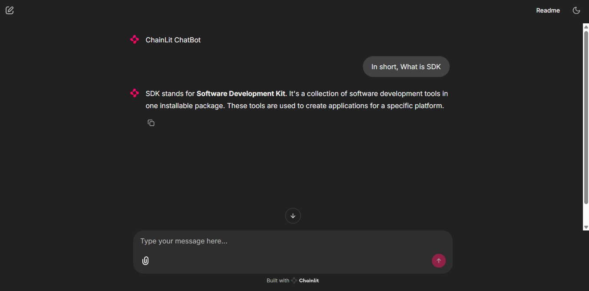

# 🧠 Chainlit Chatbot with OpenAI Agent SDK

## 📌 Assignment 04 – Intelligent Chatbot

This project demonstrates an interactive chatbot built using **Chainlit** for the user interface and the **OpenAI Agents SDK** for the conversational logic. The chatbot responds to user queries and automatically saves the complete chat history in a structured `chat_history.json` file when the session ends.

---

## 🔧 Tech Stack

- 🧱 **Chainlit** – UI and session management
- 🤖 **OpenAI Agents SDK** – Agent logic and completions
- 🐍 **Python 3.10+**
- ⚡ **uv** – Ultra-fast Python dependency manager

---

## 🎯 Features

✅ Browser-based chatbot interface  
✅ Handles multi-turn conversations  
✅ Maintains full user + assistant history  
✅ Saves history as `chat_history.json` on session end  

---

## 📂 Project Structure

📁 chatbot_project/
├── agents.py
├── my_secrets.py
├── main.py
├── chat_history.json
└── README.md

---

## 🚀 Getting Started

### 1. **Clone the Repository**
git clone https://github.com/MuhammadUsmanGM/Chainlit-bot
cd chatbot_project
2. Install Dependencies
bash
Copy code
uv add chainlit openai
3. Configure API Keys
Create a my_secrets.py file with your OpenAI or Gemini-compatible credentials:

class Secrets:
    gemini_api_key = "your-api-key"
    gemini_base_url = "https://generativelanguage.googleapis.com/v1beta/openai/"
    gemini_api_model = "gemini-2.0-flash"  # or another model
📝 Adjust variable names if you're using other Models instead of Gemini.

4. Run the Chatbot
chainlit run main.py
Then open the local URL (e.g., http://localhost:8000) in your browser.

💾 Chat History
At the end of every session, the complete chat is saved as:

[
  {
    "role": "user",
    "content": "Hello, who are you?"
  },
  {
    "role": "assistant",
    "content": "I'm your AI assistant. How can I help you today?"
  }
]
The file is saved as chat_history.json in the root directory.

## 🖼️ Chainlit Chatbot Output

